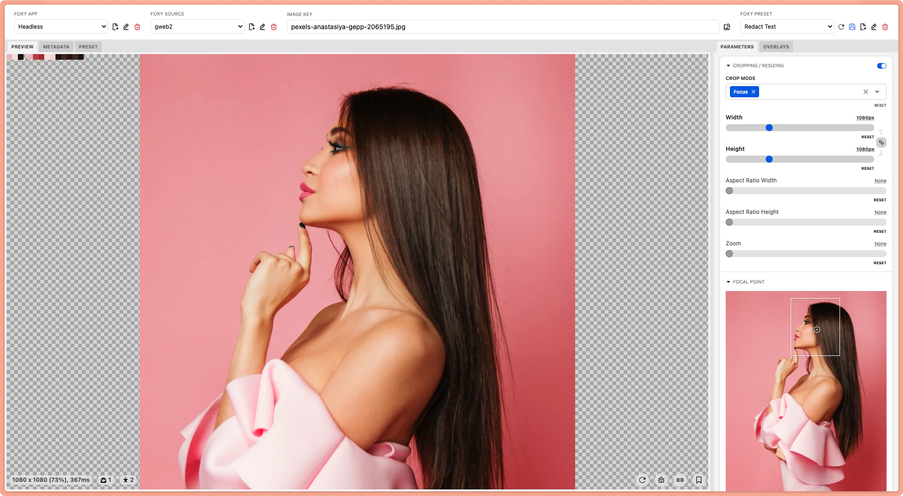

# Foxy Preset Builder

Foxy Preset Builder is a simple app to build and view presets with [Foxy Image Proxy](https://github.com/jawngee/foxy).

## Getting Started

1. Make sure you have Foxy Image Proxy running on your local machine.
2. Clone this repository.
3. Run `pnpm install` to install dependencies.
4. Run `pnpm run dev` to start the development server.
5. Open `http://localhost:5173` in your browser.

## Usage
Set the `Foxy URL`, `Access Key`, `Secret` fields at the top of the app to connect to your [Foxy Image Proxy](https://github.com/jawngee/foxy) instance.

The `Image Key` field is the key of the image you want to preview, eg `path/to/image.jpg`.

The rest should be self-explanatory.

